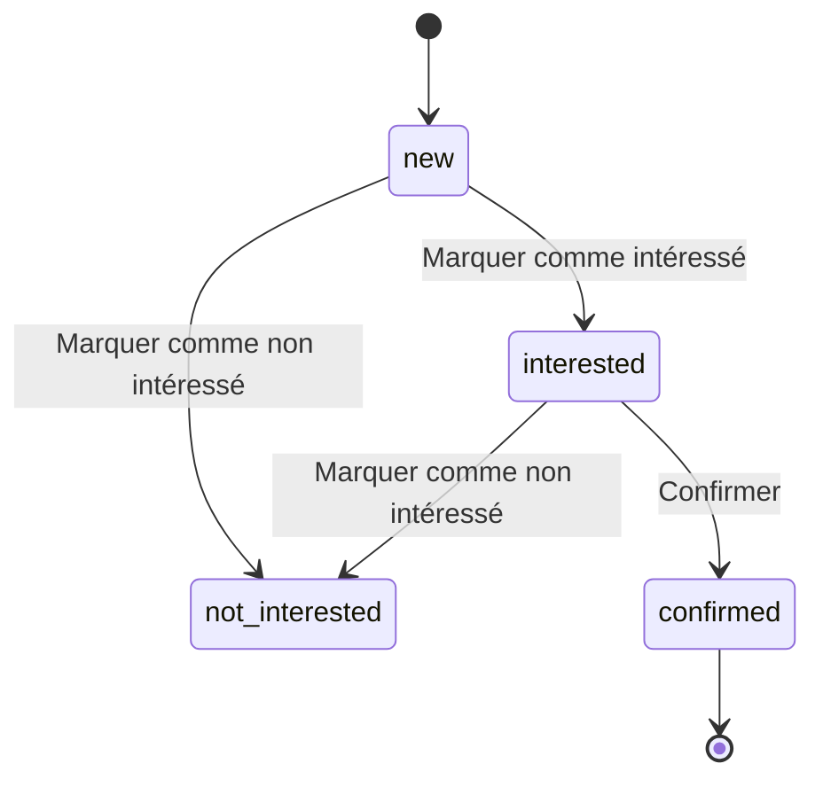
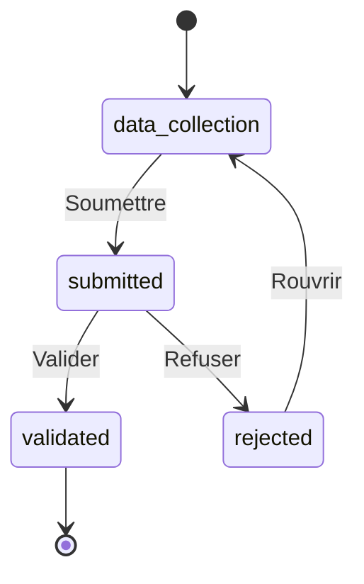
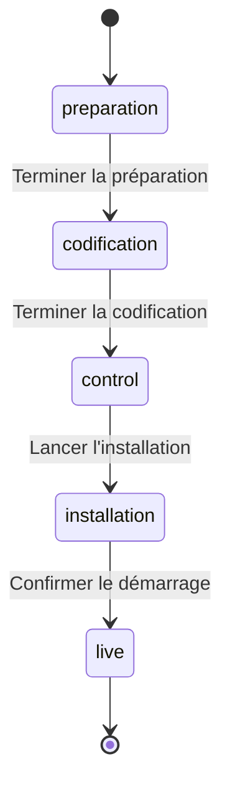

# Gestion des Ouvertures — Spécification Fonctionnelle

## 1. Objectif

Suivre l'ouverture d'une agence Cash Plus depuis le premier contact commercial jusqu'à la mise en service de l'agence, à travers trois étapes simples. Chaque étape correspond à sa propre entité (sa propre table en base de données). Passer à l'étape suivante **crée un nouvel enregistrement** dans l'entité suivante et recopie quelques champs — ce n'est pas un seul enregistrement qui change de forme au fil du temps.

```
1. Prospection            2. Demande d'ouverture      3. Suivi d'ouverture
   (un prospect)      →       (infos propriétaire   →     (papiers, installation,
                               + local, en attente          et démarrage
                               de validation)                de l'agence)
```

## 2. Rôles

Trois rôles suffisent pour faire fonctionner tout le processus :

| Rôle | Peut faire |
|---|---|
| **Agent** | Créer et suivre les prospects. Ne voit que ses propres prospections. L'accès aux demandes d'ouverture et aux suivis d'ouverture lui est bloqué. |
| **Validateur** | Gérer les demandes d'ouverture (soumettre, uploader des photos, valider, refuser) et les suivis d'ouverture (terminer la codification). Voit tous les dossiers. |
| **Manager** | Tout ce que peut faire un Validateur, plus terminer la préparation, lancer l'installation et confirmer le démarrage d'une agence. Voit tous les dossiers. |

> Un utilisateur ayant le rôle Manager n'est **pas automatiquement** Validateur, et inversement. Ce sont deux permissions distinctes, volontairement séparées — il faut les garder comme deux rôles différents, même si en pratique la même personne cumule souvent les deux.

## 3. Entités

### 3.1 Prospection

Un prospect qu'un agent (recruteur) vient de contacter.

| Champ | Type | Remarques |
|---|---|---|
| `owner_name` | texte | nom du propriétaire potentiel |
| `phone` | texte | obligatoire |
| `lead_source` | choix : `walk_in`, `website`, `facebook`, `phone`, `other` | source du contact |
| `assigned_agent` | lien → Utilisateur | qui traite ce prospect |
| `national_id` | texte | ex. numéro de CIN |
| `address`, `city` | texte | |
| `notes` | texte | |
| `state` | voir §4.1 | |
| `rejection_reason` | texte | renseigné si marqué non intéressé / non conforme |

### 3.2 Demande d'ouverture

Créée quand une Prospection est confirmée. Recueille les informations détaillées nécessaires à la validation.

| Champ | Type | Remarques |
|---|---|---|
| `reference` | texte | générée automatiquement, ex. `DO-00001` |
| `request_date` | date | fixée automatiquement à la création |
| `submitted_date` | date | fixée au moment de la soumission pour validation |
| `owner_name`, `owner_phone`, `owner_email` | texte | |
| `address`, `city` | texte | |
| `area_sqm` | nombre | surface du local |
| `agency_category` | choix : `standard`, `hot_spot`, `rural` | |
| `photos` | liste de fichiers | **au moins 5 requises avant de soumettre** |
| `state` | voir §4.2 | |
| `rejection_reason` | texte | renseigné en cas de refus |

### 3.3 Suivi d'ouverture

Créé quand une Demande d'ouverture est validée. Suit les étapes restantes jusqu'à l'ouverture de l'agence.

| Champ | Type | Remarques |
|---|---|---|
| `reference` | texte | reprise de la Demande d'ouverture |
| `agency_name` | texte | |
| `address`, `city` | texte | reprises de la Demande d'ouverture |
| `legal_documents_ready` | oui/non | ex. contrat de bail, copies CIN, registre de commerce, attestation bancaire réunis |
| `fit_out_ready` | oui/non | local aménagé/équipé et prêt |
| `fit_out_photos` | liste de fichiers | au moins 1 requise |
| `network_setup_ready` | oui/non | code agence + systèmes de paiement configurés |
| `compliance_checked` | oui/non | le manager a vérifié tout ce qui précède |
| `installation_done` | oui/non | le technicien confirme que l'installation sur site est terminée |
| `start_date` | date | fixée automatiquement au démarrage effectif de l'agence |
| `state` | voir §4.3 | |

## 4. Machines à états

### 4.1 Prospection



| Transition | Qui | Condition | Effet |
|---|---|---|---|
| Marquer comme intéressé / non intéressé | Agent | — | met simplement à jour `state` (et `rejection_reason` si besoin) |
| Confirmer | Agent | doit être actuellement `interested` | crée une nouvelle Demande d'ouverture à l'état `data_collection`, en recopiant certains champs (voir §5.1) |

### 4.2 Demande d'ouverture



| Transition | Qui | Condition | Effet |
|---|---|---|---|
| Soumettre | Validateur ou Manager | au moins 5 photos jointes | fixe `submitted_date = aujourd'hui` |
| Valider | Validateur ou Manager | — | crée un nouveau Suivi d'ouverture à l'état `preparation`, en recopiant certains champs (voir §5.2) |
| Refuser | Validateur ou Manager | un `rejection_reason` doit être renseigné | — |
| Rouvrir | Agent | — | retourne à `data_collection` pour modification |

### 4.3 Suivi d'ouverture



| Transition | Qui | Condition | Effet |
|---|---|---|---|
| Terminer la préparation | Manager | `legal_documents_ready = oui` | passe à l'état `codification` |
| Terminer la codification | Validateur | `fit_out_ready = oui` ET au moins 1 photo d'aménagement ET `network_setup_ready = oui` | passe à l'état `control` |
| Lancer l'installation | Manager | `compliance_checked = oui` | passe à l'état `installation` |
| Confirmer le démarrage | Manager | `installation_done = oui` | fixe `start_date = aujourd'hui`, passe à l'état `live` |

## 5. Correspondance des champs entre étapes

### 5.1 Prospection → Demande d'ouverture (à la Confirmation)

`owner_name`, `phone → owner_phone`, `address`, `city` sont recopiés. La nouvelle demande démarre à l'état `data_collection` avec `request_date` fixée à aujourd'hui.

### 5.2 Demande d'ouverture → Suivi d'ouverture (à la Validation)

`reference`, `address`, `city`, `agency_category` sont recopiés. Le nouveau suivi démarre à l'état `preparation`.

## 6. Écrans nécessaires

| Écran | Affiche | Remarques |
|---|---|---|
| Liste + fiche Prospection | tous les prospects, filtrables par état | la fiche comporte les boutons "Marquer intéressé/non intéressé" et "Confirmer" |
| Liste + fiche Demande d'ouverture | toutes les demandes, filtrables par état | la fiche comporte les boutons "Soumettre"/"Refuser"/"Valider"/"Rouvrir", une zone d'ajout de photos |
| Liste + fiche Suivi d'ouverture | tous les suivis, filtrables par état | la fiche comporte un bouton par étape ; afficher clairement l'état courant (ex. une barre d'étapes) |

Les boutons ne doivent être visibles que pour les rôles autorisés à les utiliser, et uniquement dans les états où l'action a un sens (voir les tableaux du §4).

## 7. Questions ouvertes

1. Que devient une Demande d'ouverture refusée après un certain temps — reste-t-elle visible indéfiniment, ou est-elle archivée ?
2. Un Agent doit-il être notifié automatiquement lorsque sa demande est validée ou refusée ?

## 8. Pistes d'amélioration (non nécessaires pour une première version)

- Suivre les agences/points de vente concurrents à proximité d'une demande.
- Permettre à plusieurs personnes de valider ensemble un suivi d'ouverture (plutôt qu'un seul contrôle Manager).
- Un processus similaire pour deux autres types d'ouvertures (agences propres, détaillants) — même principe, entités différentes.
